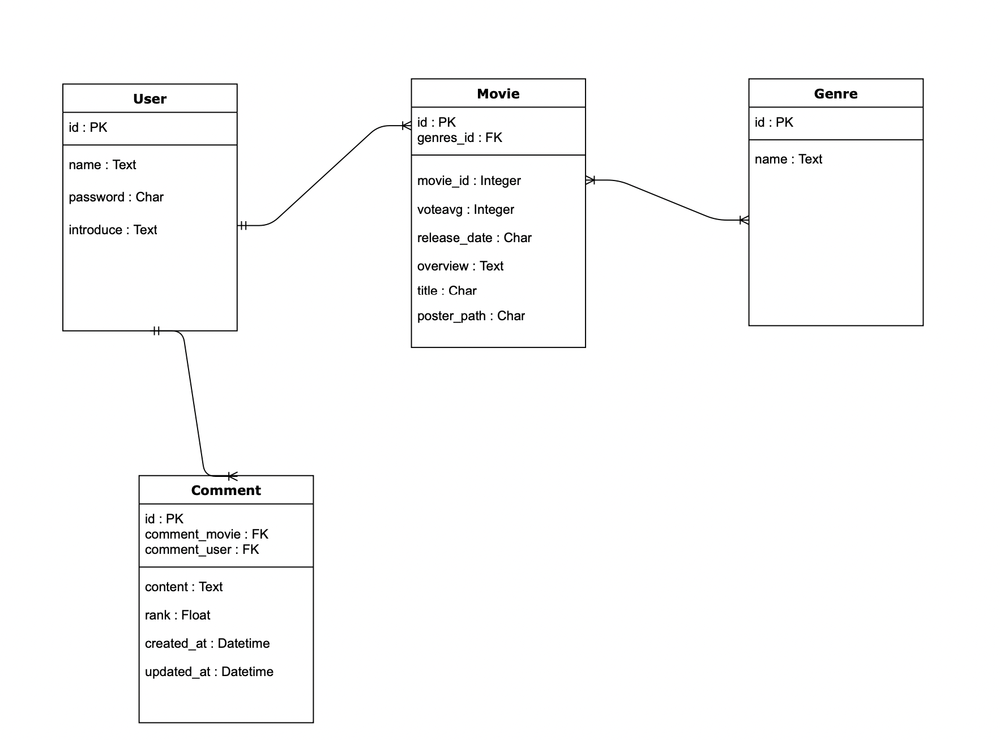

# 📌 반드시 들어갈 내용

## 1. 팀원 정보 및 업무 분담 내역

- BackEnd : 조현식
  - 데이터 모델링, REST_API 설계, 유저인증 기능, 유튜브 API, 커뮤니티, 마이페이지 기능구현 
- FrontEnd: 정상근
  - 전반적인 UI 디자인, Vue 컴포넌트 설계, 추천알고리즘 구현, 영화정보 페이지 기능구현

## 2. 목표 서비스 구현 및 실제 구현 정도

- 목표서비스
  - 미술그림 기반 심리테스트를 통한 영화 추천페이지 구현
- 구현정도
  - 80%
  - 다른 심리테스를 추가하려고 했지만 시간관계상 메인 테스트만 구현함

## 3. 데이터베이스 모델링(ERD)

## 4. 필수 기능에 대한 설명

- 로그인/회원가입 기능

- 장르별 영화데이터 출력 페이지

- 그림으로 하는 심리테스트 기반 영화추천 서비스

- 영화추천 다시받기 기능

- 영화 상세페이지 구현

- 유튜브 API를 이용한 영화 예고편 출력

- 영화리뷰 기능

- 게시판기능(리뷰작성)

- 마이페이지 기능

- 활동에 따른 등급기능

  

## 5. 배포 서버 URL

## 6. 기타(느낀점)

## 7. 영상 시나리오 (2분30초)

1. 회원가입/로그인
2. 홈에서 => 장르별 영화 페이지로 이동 -> 장르선택
3. 추천 시스템 => 영화 추천받기
4. 맘에안들어서 다시받기
5. 영화 상세정보 보기
6. 영화 예고편 보기
7. 댓글쓰기
8. 마이페이지 등급확인하기

## 8. 발표 시나리오 (2분 30초)

1. 팀소개

2. 기술스택 (django - vue)

3. 주제 (심리테스트 기반 영화추천 사이트) 

   - 이제는 할 수 없는 신빙성 있는 그림기반 심리테스트 적용 (약 200만)
   - 현재 심리에 따라 맞춤 장르를 매칭하고 랜덤으로 영화추천

4. 핵심기능

   - 영화추천알고리즘
   - 장르별 영화
   - 유튜브 API 이용
   - 모델구현 - 장르별 영화 시리얼라이징
   - Favicon
   - 파이리진화

5. 느낀점

   

   

   

