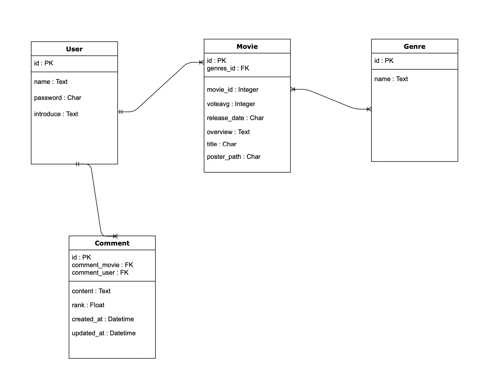
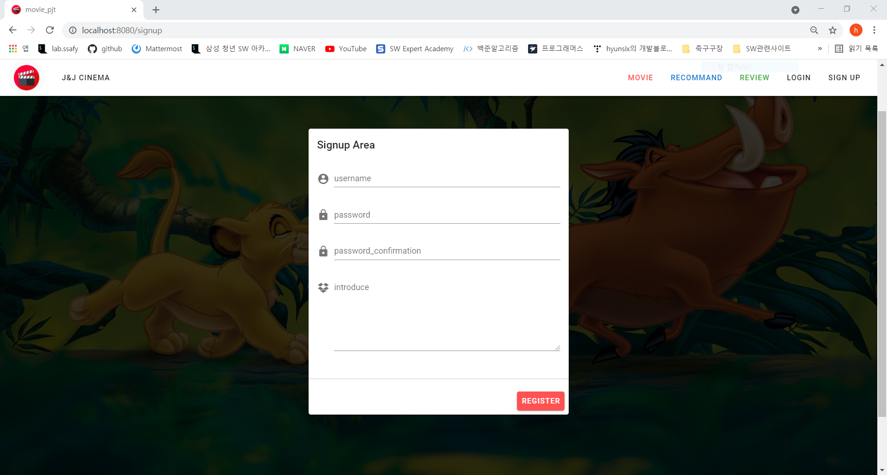
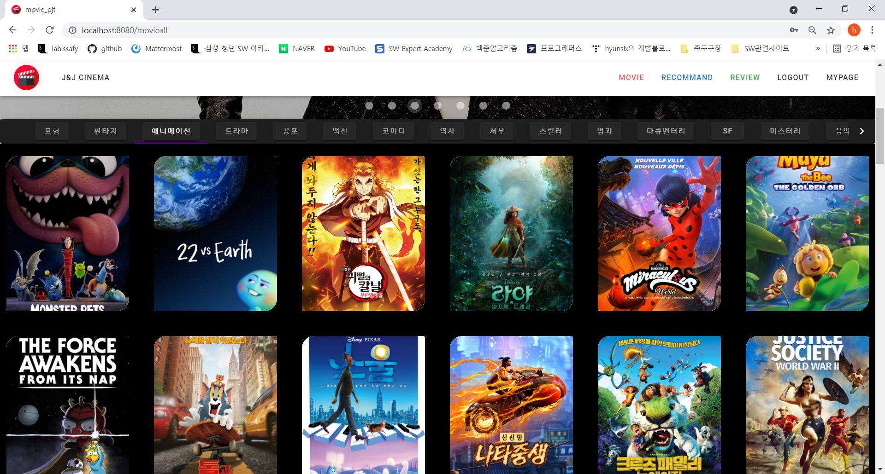
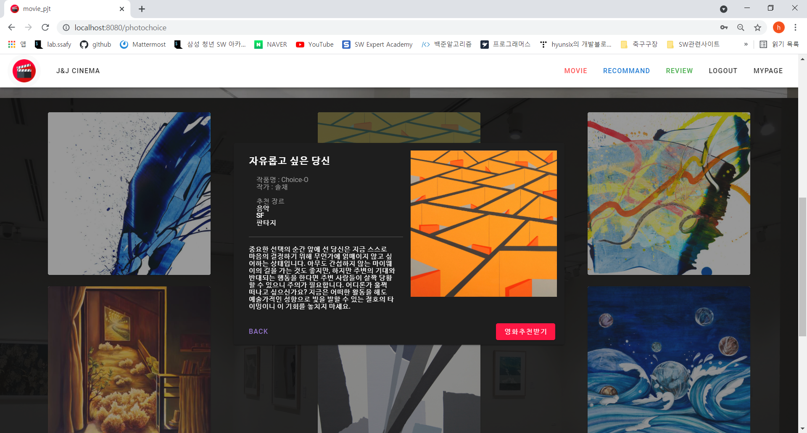
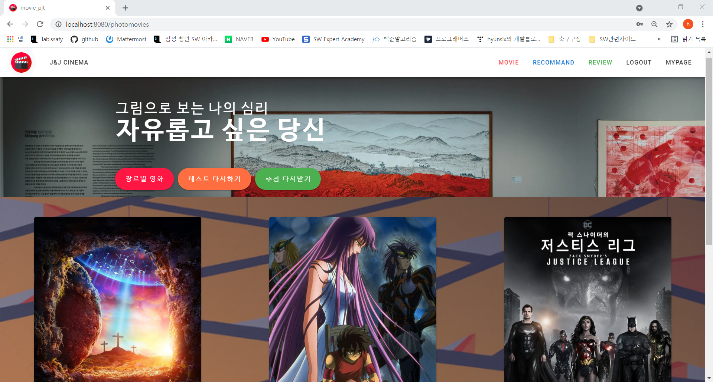
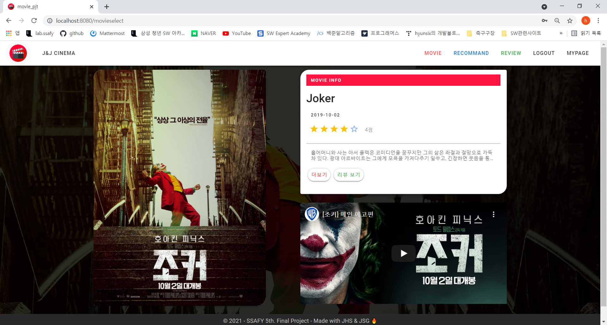
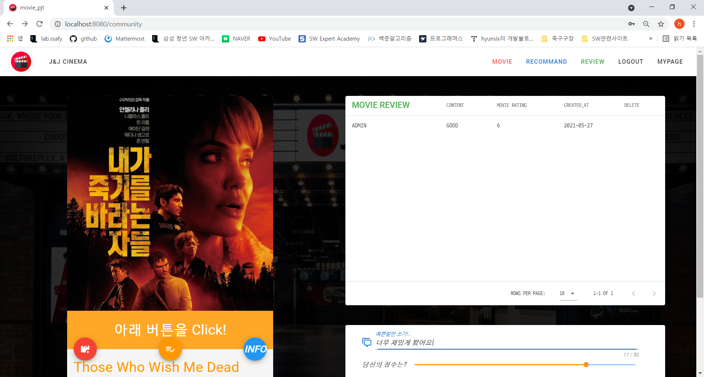
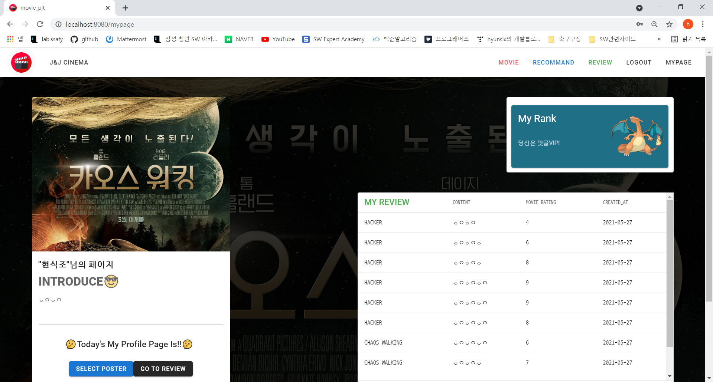

# 📌 READ ME

## 1. 팀원 정보 및 업무 분담 내역

- BackEnd : 조현식
  - 데이터 모델링, REST_API 설계, 유저인증 기능, 유튜브 API, 커뮤니티, 마이페이지 기능구현 
- FrontEnd: 정상근
  - 전반적인 UI 디자인, Vue 컴포넌트 설계, 추천알고리즘 구현, 영화정보 페이지 기능구현

## 2. 목표 서비스 구현 및 실제 구현 정도

- 목표서비스
  - 미술그림 기반 심리테스트를 통한 영화 추천페이지 구현

## 3. 데이터베이스 모델링(ERD)

## 4. 필수 기능

1. 회원가입/로그인

2. 홈에서 => 장르별 영화 페이지로 이동 -> 장르선택

3. 추천 시스템 => 영화 추천받기

   

4. 영화 상세정보 보기

5. 댓글쓰기

6. 마이페이지 등급확인하기

## 5. 발표 시나리오 (2분 30초)

1. 팀소개

2. 기술스택 (django - vue)

3. 주제 (심리테스트 기반 영화추천 사이트) 

   - 이제는 할 수 없는 신빙성 있는 그림기반 심리테스트 적용 (약 200만)
   - 현재 심리에 따라 맞춤 장르를 매칭하고 랜덤으로 영화추천

4. 핵심기능

   - 영화추천알고리즘
   - 장르별 영화
   - 유튜브 API 이용
   - 모델구현 - 장르별 영화 시리얼라이징
   - Favicon
   - 파이리진화

5. 느낀점

   

## 6. 느낀점

벌써 최종프로젝트라고 하니 감회가 새롭다. 그동안 이론과 짧은 프로젝트를 통해 익혔던 지식들을재확인할 수 있어서 좋았다. 특히 내가 지금 보고 있는 인터넷 화면이 어떤 과정들을 거쳐서 앞에 나타나는지 보다 더 명확히 그림이 그려진 시간였던 것 같다. 또한 협업하는 방법, 내가 흥미있는 분야에 대해 조금씩 더 알아갈 수 있었던 매우 값진 시간이었다고 생각한다.

